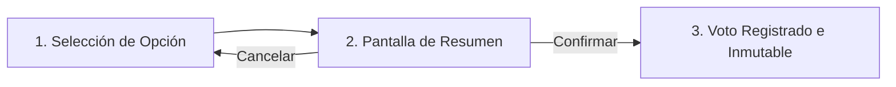

# Guía de Verificación: Renombrado de Estados OT y Flujo de Votaciones Online

Esta guía detalla el procedimiento paso a paso para verificar tanto en el **Panel Web del Administrador de Fincas (AF)** como en la **App Móvil del Vecino** las correcciones de estados de OT y el nuevo sistema completo de **Votaciones Online (Flujo A y Flujo B)**.

---

## 📋 Índice de Pruebas

1. [Prueba 1: Renombrado de Estados de Órdenes de Trabajo (Panel AF)](#prueba-1-renombrado-de-estados-de-%C3%B3rdenes-de-trabajo-panel-af)
2. [Prueba 2: Creación de Votaciones y Juntas (Panel AF)](#prueba-2-creaci%C3%B3n-de-votaciones-y-juntas-panel-af)
3. [Prueba 3: Tarjeta de Votación Activa en Home del Vecino](#prueba-3-tarjeta-de-votaci%C3%B3n-activa-en-home-del-vecino)
4. [Prueba 4: Flujo A — Decisión Única sin Junta (App Móvil)](#prueba-4-flujo-a--decisi%C3%B3n-%C3%BAnica-sin-junta-app-m%C3%B3vil)
5. [Prueba 5: Flujo B — Junta Extraordinaria Multipunto (App Móvil)](#prueba-5-flujo-b--junta-extraordinaria-multipunto-app-m%C3%B3vil)
6. [Prueba 6: Caso Especial — Usuario Sin Derecho a Voto / Deudor](#prueba-6-caso-especial--usuario-sin-derecho-a-voto--deudor)
7. [Prueba 7: Cierre, Escrutinio Ponderado y Acta Oficial PDF (Panel AF)](#prueba-7-cierre-escrutinio-ponderado-y-acta-oficial-pdf-panel-af)

---

## Prueba 1: Renombrado de Estados de Órdenes de Trabajo (Panel AF)

**Objetivo:** Validar que los estados de OT reflejen la nueva terminología exacta requerida.

### Pasos:
1. Accede al panel web de administración en `/incidents`.
2. Revisa la barra superior de filtros por estado y la columna central de la tabla/lista de incidencias:
   - **"Sin respuesta"** (antiguo *Caducada*): Indica que el proveedor recibió la OT pero no respondió dentro del plazo.
   - **"Cita no atendida"** (antiguo *No presentada*): Indica que el proveedor aceptó y agendó la cita, pero no acudió a la intervención.
3. **Comportamiento esperado:** 
   - Las etiquetas de los filtros y badges muestran exactamente *"Sin respuesta"* y *"Cita no atendida"*.
   - El administrador de fincas puede reasignar un nuevo proveedor desde cualquiera de estos dos estados.

---

## Prueba 2: Creación de Votaciones y Juntas (Panel AF)

**Objetivo:** Validar que el AF pueda crear tanto decisiones individuales como juntas con múltiples puntos.

### Pasos:
1. Accede a `/votes` en el panel web.
2. Pulsa el botón **"Nueva Votación"**.
3. **Caso A (Decisión sin Junta):**
   - Selecciona el tipo **"Decisión sin Junta"**.
   - Asunto: `Reparación del ascensor principal`.
   - Presupuesto estimado: `5.500 €`.
   - Descripción: `Sustitución del motor de tracción por avería grave.`.
   - Fecha límite: Selecciona una fecha/hora futura.
   - Pulsa **"Publicar Votación"**.
4. **Caso B (Junta Extraordinaria):**
   - Pulsa **"Nueva Votación"** y selecciona **"Junta Extraordinaria"**.
   - Título de la Junta: `Junta General Extraordinaria 2026`.
   - En la sección **Puntos del Orden del Día**, define los puntos:
     * Punto 1: `Reparación del ascensor` (Importe: `5.500 €`).
     * Punto 2: `Cambio de empresa de limpieza` (Importe: `1.200 €`).
     * Punto 3: `Aprobación de cuentas del ejercicio` (Sin importe).
   - Pulsa **"Publicar Votación"**.
5. **Comportamiento esperado:**
   - Ambas sesiones quedan creadas en estado **"Abierta"**.
   - La junta muestra la lista de los 3 puntos con sus importes.
   - Los vecinos reciben la notificación push correspondiente en sus móviles.

---

## Prueba 3: Tarjeta de Votación Activa en Home del Vecino

**Objetivo:** Verificar la visualización contextual y accesos directos en el inicio de la app móvil.

### Pasos:
1. Abre la aplicación móvil e inicia sesión como propietario/vecino.
2. Observa la tarjeta de votación en la pantalla de inicio:
   - Si la votación activa es **Decisión individual**:
     * Título: `VOTACIÓN ACTIVA`.
     * Contenido: Título del asunto + Importe en verde (`5.500 €`).
     * Botón: `Votar ahora →` (Color turquesa).
   - Si la votación activa es **Junta Extraordinaria**:
     * Título: `JUNTA EXTRAORDINARIA`.
     * Contenido: `X decisiones para votar`.
     * Botón: `Entrar a votar →` (Color morado).
3. Pulsa sobre el botón de acción para entrar directamente al flujo de votación.

---

## Prueba 4: Flujo A — Decisión Única sin Junta (App Móvil)

**Objetivo:** Validar las 3 pantallas del flujo para un único acuerdo puntual.

### Pasos:
1. **Pantalla 1 (Votación):**
   - Comprueba el encabezado: `Votación Activa`, título, importe (`5.500 €`) y fecha límite.
   - Pregunta: `¿Apruebas reparación del ascensor principal?`.
   - Verifica los 3 botones de opción: **[Apruebo]** (verde al seleccionar), **[Rechazo]** (rojo al seleccionar), **[Me abstengo]** (gris al seleccionar).
   - Comprueba que el botón inferior *"Enviar mi voto →"* solo se habilita al seleccionar una opción.
   - Cambia de selección entre las 3 opciones para comprobar la reactividad.
   - Pulsa **"Enviar mi voto →"**.
2. **Pantalla 2 (Resumen previo):**
   - Icono central de envío ✈️.
   - Título: `Vas a enviar tu voto`.
   - Subtítulo: `Esta acción es definitiva. No podrás modificar tus respuestas una vez confirmadas.`.
   - Tarjeta de resumen con la opción seleccionada.
   - Pulsa **"Cancelar y volver a revisar"**: Comprueba que regresas a la pantalla 1 y puedes cambiar tu voto.
   - Vuelve a pulsar *"Enviar mi voto →"* y ahora pulsa **"Confirmar y Enviar"**.
3. **Pantalla 3 (Voto Registrado):**
   - Icono de check verde ✓.
   - Título: `¡Voto registrado!`.
   - Tarjeta sellada con la respuesta elegida, fecha/hora exacta de registro y coeficiente de propiedad.
   - Si intentas volver a entrar, el sistema te muestra directamente este resumen y **no te permite volver a votar**.

---

## Prueba 5: Flujo B — Junta Extraordinaria Multipunto (App Móvil)

**Objetivo:** Validar que todos los puntos del orden del día se voten desde una sola pantalla sin dejar ninguno pendiente.

### Pasos:
1. **Pantalla 1 (Votación en Pantalla Única):**
   - Comprueba el encabezado: `Junta Extraordinaria`, título y fecha de cierre.
   - Verifica que **todos los puntos** (1, 2 y 3) aparecen listados de forma contigua con sus importes individuales.
   - Cada punto dispone de sus 3 botones: **[Apruebo]** • **[Rechazo]** • **[Me abstengo]**.
   - **Contador interactivo:**
     * Sin responder: Muestra `0 de 3 respondidas` y `Faltan 3 puntos`. Botón inferior deshabilitado (`#CBD5E1`).
     * Responde el Punto 1: Cambia a `1 de 3 respondidas` y `Faltan 2 puntos`.
     * Responde el Punto 2: Cambia a `2 de 3 respondidas` y `Faltan 1 puntos`.
     * Responde el Punto 3: Cambia a `3 de 3 respondidas` y `✓ Todo listo para enviar`. El botón se ilumina en morado y se habilita: **"Enviar mis votos →"**.
   - Pulsa **"Enviar mis votos →"**.
2. **Pantalla 2 (Resumen previo conjunto):**
   - Título: `Vas a enviar tus votos` con `3 decisiones a enviar`.
   - Tarjeta con el desglose exacto de lo votado en cada punto (ej. Punto 1: *Apruebo*, Punto 2: *Rechazo*, Punto 3: *Me abstengo*).
   - Pulsa **"Cancelar y volver a revisar"** para verificar que puedes modificar cualquier elección.
   - Pulsa **"Confirmar y Enviar"**.
3. **Pantalla 3 (Votos Registrados):**
   - Check morado ✓ con el mensaje `¡Votos registrados!`.
   - Resumen completo e inmutable de los 3 puntos con timestamp de registro y coeficiente de participación.

---

## Prueba 6: Caso Especial — Usuario Sin Derecho a Voto / Deudor

**Objetivo:** Verificar que los propietarios con recibos pendientes no puedan emitir votos y se les informe con claridad legal.

### Pasos:
1. En la base de datos o mediante el panel, asegúrate de que el usuario tenga alguna cuota en estado `PENDING` u `OVERDUE`.
2. Accede a la app móvil con esa cuenta y entra a la sección de **Votaciones**.
3. **Comportamiento esperado:**
   - Se muestra una pantalla de bloqueo con **candado rojo 🔒**.
   - Título: `No puedes votar en esta junta / votación`.
   - Motivo: `Tienes pagos pendientes con la comunidad y no tendrás derecho a voto. Ponte al día para poder participar en las votaciones.`.
   - **No se muestra ningún botón ni opción de votación**.
   - Aparece el botón de acción rápida: `Ver mis cuotas pendientes →` para ir directamente a la pasarela de pagos.
   - Cuadro legal explicativo citando la Ley de Propiedad Horizontal (LPH).

---

## Prueba 7: Cierre, Escrutinio Ponderado y Acta Oficial PDF (Panel AF)

**Objetivo:** Validar el recuento ponderado por coeficientes y la generación del acta oficial.

### Pasos:
1. Regresa al panel web de administración en `/votes`.
2. En la tarjeta de la sesión con votos emitidos, comprueba las barras de escrutinio:
   - Se reflejan los votos emitidos para **Apruebo**, **Rechazo** y **Me abstengo** con su porcentaje ponderado por coeficiente de participación.
3. Pulsa el botón **"Cerrar y generar acta"** y confirma la alerta.
4. **Comportamiento esperado:**
   - La sesión pasa a estado **"Cerrada"**.
   - Se habilita el botón **"Acta PDF"**.
5. Pulsa **"Acta PDF"** para descargar el documento oficial.
6. Abre el PDF descargado y verifica:
   - Encabezado oficial con título, fecha, tipo de junta y administrador.
   - Desglose punto por punto con número de votos, porcentaje por coeficientes y veredicto (*APROBADO* / *RECHAZADO*).
   - Sello legal de la plataforma Aconvi.
